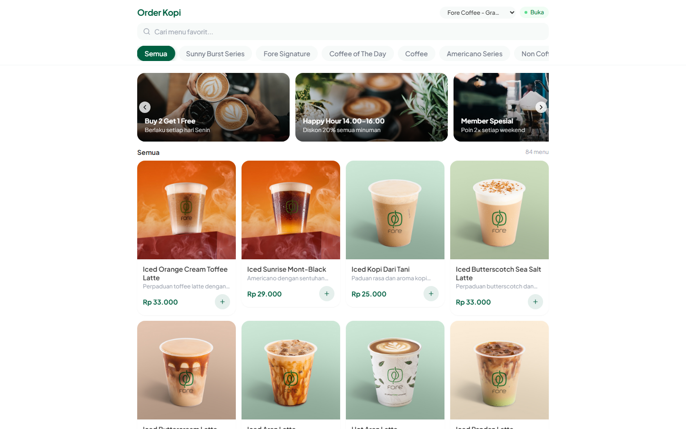
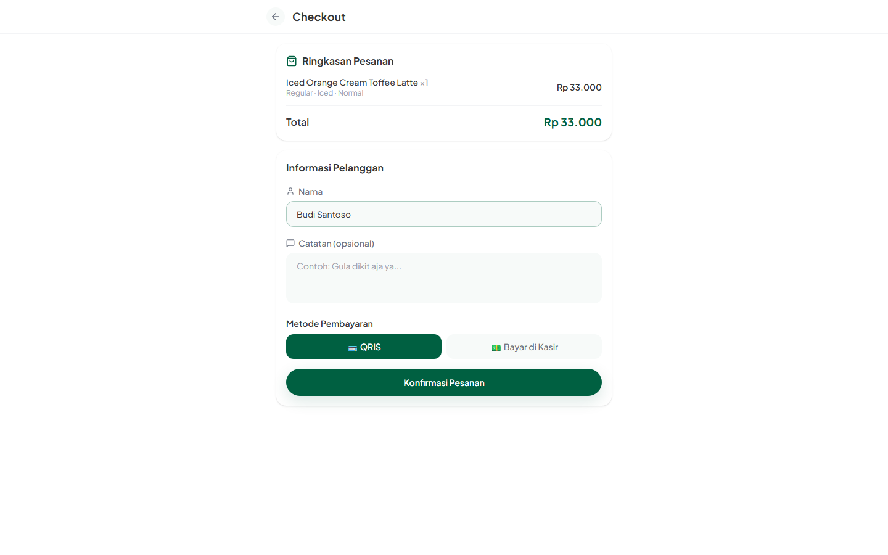
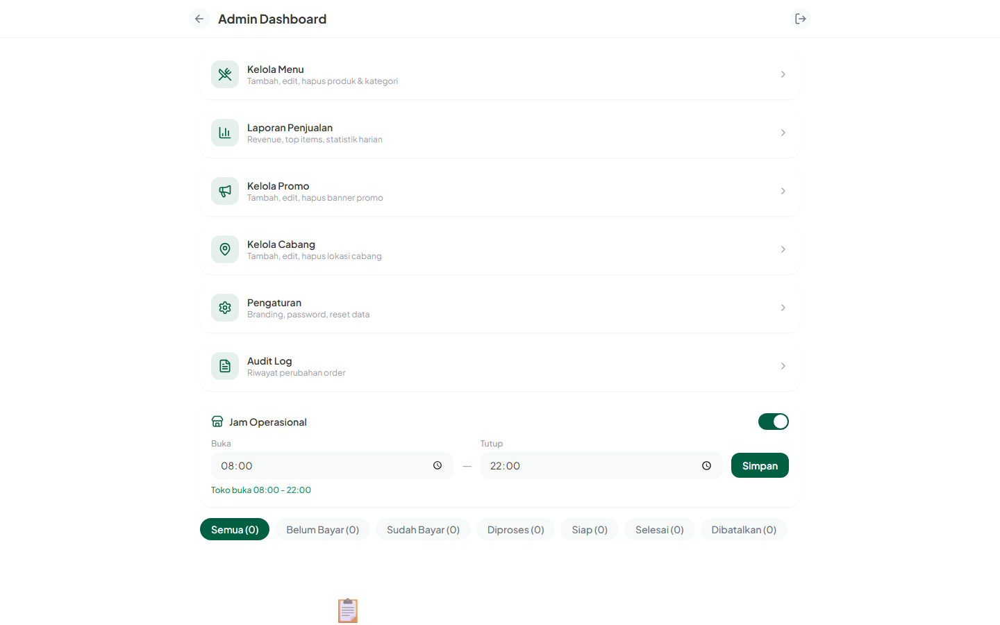
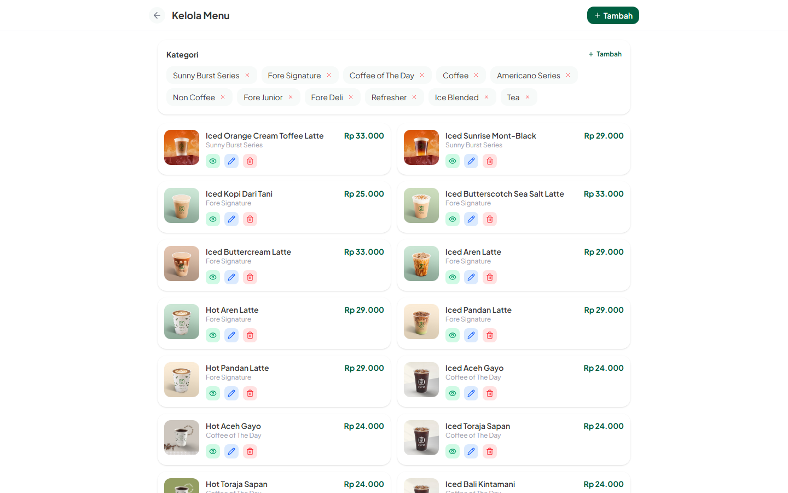
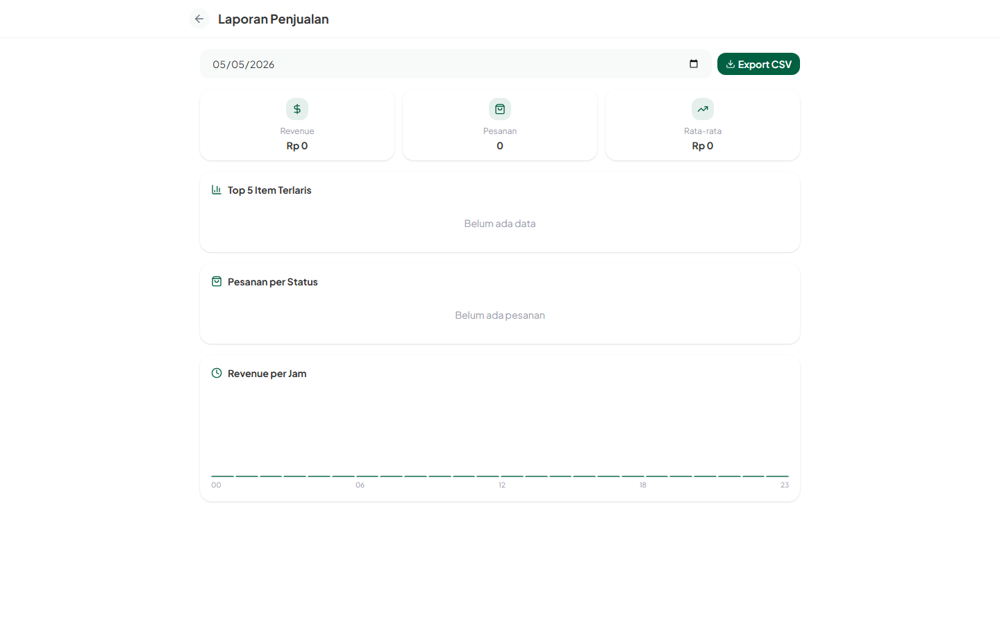

# Order Kopi

**Aplikasi pemesanan kopi online untuk coffee shop — siap pakai, mudah dikustomisasi.**

[](https://react.dev)
[](https://vite.dev)
[](https://tailwindcss.com)
[](https://supabase.com)

---

## 📸 Screenshots

> **Catatan:** Tambahkan screenshot aplikasi Anda di folder `screenshots/` dan update link di bawah ini.

### Customer Interface
| Menu & Keranjang | Order Status | Rating & Review |
|------------------|--------------|-----------------|
|  |  |  |
| Browse menu dengan kategori, search, dan filter | Track pesanan real-time dengan estimasi waktu | Berikan rating dan review setelah pesanan selesai |

### Admin Dashboard
| Dashboard | Kelola Menu | Laporan Penjualan |
|-----------|-------------|-------------------|
|  |  |  |
| Monitor pesanan real-time dengan filter status | CRUD produk, kategori, dan upload foto | Analisis penjualan harian dengan grafik |

### Payment Flow
| QRIS Static + Unique Code | Upload Payment Proof | Payment Confirmed |
|---------------------------|---------------------|-------------------|
|  |  |  |
| Scan QRIS & pay exact amount (Rp 50,123) | Upload screenshot as proof | Order confirmed after verification |

---

## ✨ Mengapa Order Kopi?

### 🚀 Siap Produksi
- **Production-Ready:** Security hardening lengkap (webhook signature, RLS policies, rate limiting)
- **Scalable Architecture:** Supabase PostgreSQL + Edge Functions untuk performa optimal
- **Zero Downtime:** Real-time updates tanpa refresh halaman
- **PWA Support:** Install di HP seperti aplikasi native

### 💰 Hemat Biaya
- **Gratis untuk Mulai:** Supabase free tier (500K requests/bulan) + Vercel/Netlify hosting gratis
- **No Monthly Fee:** Tidak ada biaya bulanan untuk infrastruktur dasar
- **Pay As You Grow:** Bayar hanya saat traffic meningkat
- **Open Source:** Tidak ada biaya lisensi, customize sesuka hati

### 🔒 Keamanan Enterprise
- **Payment Proof Validation:** Magic bytes check prevents file spoofing
- **Fraud Detection System:** Risk scoring (0-100) with pattern detection
- **Unique Code Collision Prevention:** Database constraint + unique code (0-500 range, max Rp 500 extra)
- **Concurrent Verification Protection:** Optimistic locking prevents duplicate approvals
- **Row Level Security (RLS):** Database-level isolation antar customer
- **Rate Limiting:** Server-side protection (10 req/min per IP)
- **Session Token Security:** Setiap customer punya token unik dengan auto-refresh
- **Audit Trail:** Immutable log untuk semua perubahan order (15+ event types)
- **Generic Error Messages:** No information disclosure for security

### ⚡ Developer Experience
- **Modern Stack:** React 19 + Vite 8 + Tailwind CSS 4
- **Type Safety:** Full TypeScript support (opsional)
- **Hot Reload:** Instant feedback saat development
- **Easy Deployment:** One-click deploy ke Vercel/Netlify
- **Comprehensive Docs:** Setup guide, troubleshooting, dan API reference lengkap

### 🎯 Fitur Bisnis
- **Multi-Branch:** Kelola beberapa cabang toko dalam satu aplikasi
- **Dynamic Pricing:** Harga berbeda per ukuran dan customization
- **Product Discount:** Diskon % per produk dengan harga coret
- **Voucher System:** BOGO, Fixed Rp, dan Percentage discount
  - Validasi otomatis (expiry, usage limit, min purchase)
  - Atomic increment untuk prevent race condition
  - Track usage per voucher
- **Promo Management:** Banner promo dengan scheduling
- **Sales Analytics:** Laporan penjualan harian dengan grafik per jam
- **Customer Insights:** Rating, review, dan feedback tracking
- **WhatsApp Integration:** Share order link via WhatsApp

### 🆕 New Features (2026-05)
- **Unique Code System:** 0-500 range per order (max Rp 500 extra, e.g., Rp 50,123 for Rp 50k order)
- **Auto-Verification:** 80%+ orders auto-approved, reduces admin workload
- **Bulk Verification:** Admin can verify multiple orders at once
- **Payment Analytics Dashboard:** Track auto-verification rate, fraud detection, avg time
- **Mobile Camera Upload:** Direct camera access for payment proof
- **Storage Optimization:** WebP support, 71% storage reduction
- **Enhanced Fraud Detection:** Duplicate proof, rapid submission, risk scoring
- **Payment Proof Auto-Cleanup:** Auto-delete proofs >90 days old
- **Feature Flags:** Gradual rollout support for new features
- **Performance Indexes:** 5 indexes for 10-100x faster queries

### 📄 Payment Flexibility
- **QRIS Static with Unique Code:** Unique code (0-500) per order (e.g., Rp 50,123 for Rp 50k order)
- **Auto-Verification:** 80%+ orders auto-approved when amount matches
- **Fraud Detection:** Risk scoring system with manual review for suspicious patterns
- **Payment Proof Upload:** Secure file upload with magic bytes validation
- **Cash Payment:** Fallback untuk bayar di kasir
- **Zero Transaction Fees:** No payment gateway fees (save Rp 24M/year vs Cashi.id)
- **Payment Tracking:** Complete audit log for all payment events

### 📱 Mobile-First Design
- **Responsive:** Optimal di semua ukuran layar (mobile, tablet, desktop)
- **Touch-Friendly:** UI dirancang untuk interaksi touch
- **Fast Loading:** Optimized assets dan lazy loading
- **Offline Support:** PWA dengan service worker (coming soon)

---

## 🎯 Use Cases

### Coffee Shop / Café
- Kurangi antrian kasir dengan self-order
- Customer bisa order dari meja (scan QR code)
- Notifikasi otomatis saat pesanan siap

### Food Court / Kantin
- Multi-tenant support (beberapa tenant dalam satu aplikasi)
- Tracking antrian per tenant
- Laporan penjualan terpisah per tenant

### Event / Festival
- Handle high traffic dengan rate limiting
- Quick order untuk mengurangi antrian
- Real-time dashboard untuk monitor penjualan

### Cloud Kitchen / Ghost Kitchen
- Order online tanpa dine-in
- Integrasi dengan delivery service (via webhook)
- Focus pada efisiensi operasional

---

## 🏆 Kelebihan Dibanding Kompetitor

| Fitur | Order Kopi | Kompetitor A | Kompetitor B |
|-------|------------|--------------|--------------|
| **Biaya Setup** | Gratis | $99/bulan | $49/bulan |
| **Dynamic QRIS** | ✅ QRIS Static + Unique Code | ❌ Static only | ✅ Via Midtrans |
| **Auto-Confirm Payment** | ✅ Auto-Verification (80%+) | ❌ Manual | ✅ Webhook |
| **Rate Limiting** | ✅ Server-side | ❌ None | ✅ Client-side |
| **Audit Logging** | ✅ Immutable | ❌ None | ⚠️ Basic |
| **Multi-Branch** | ✅ Built-in | ⚠️ Add-on | ✅ Built-in |
| **PWA Support** | ✅ Yes | ❌ No | ✅ Yes |
| **Open Source** | ✅ MIT License | ❌ Proprietary | ❌ Proprietary |
| **Customizable** | ✅ Full access | ⚠️ Limited | ❌ No |
| **Self-Hosted** | ✅ Yes | ❌ No | ❌ No |

---

## 📊 Tech Stack

### Frontend
- **React 19** - Latest React with concurrent features
- **Vite 8** - Lightning-fast build tool
- **Tailwind CSS 4** - Utility-first CSS framework
- **Lucide React** - Beautiful icon library
- **React Router DOM 7** - Client-side routing

### Backend
- **Supabase** - PostgreSQL database + Auth + Storage + Edge Functions
- **Edge Functions** - Serverless functions for payment verification, fraud detection, auto-cleanup
- **PostgreSQL** - Relational database with RLS
- **Supabase Storage** - File storage for QRIS image and payment proofs

### Payment
- **QRIS Static** - Zero transaction fees (save Rp 24M/year)
- **Unique Code Verification** - 0-500 range codes for auto-verification
- **Fraud Detection** - Risk scoring system

### DevOps
- **Vercel / Netlify** - Frontend hosting dengan CDN
- **GitHub Actions** - CI/CD pipeline (opsional)
- **Supabase CLI** - Database migrations dan deployment

---

## Fitur

### Pelanggan
- Lihat menu dengan kategori dan pencarian
- **Diskon Produk:** Harga coret + badge diskon (e.g., -20%)
- Pilih ukuran (Small/Regular/Large), suhu (Hot/Iced), dan level gula
- Keranjang belanja dengan quantity adjustment
- **Voucher System:** Input kode voucher untuk diskon tambahan
  - Buy 1 Get 1 (BOGO) - Item termurah gratis
  - Fixed Discount (Rp) - Potongan harga tetap
  - Percentage Discount (%) - Potongan persentase
- Checkout dengan QRIS Static + unique code atau bayar di kasir (cash)
- Tracking status pesanan real-time (Bayar → Menunggu → Diproses → Siap → Selesai)
- Estimasi waktu tunggu + posisi antrian
- Rating & review setelah pesanan selesai
- Share pesanan via WhatsApp
- Pilih cabang toko
- Banner promo dinamis
- PWA — bisa di-install di HP

### Admin
- Dashboard pesanan real-time dengan filter status
- Update status pesanan (konfirmasi bayar → proses → siap → selesai)
- Kelola menu (CRUD produk + kategori, upload foto)
- **Kelola Diskon Produk:** Set diskon % per produk dengan preview harga
- **Kelola Voucher:** CRUD voucher dengan tipe BOGO/Fixed/Percentage
  - Set kode voucher (e.g., BOGO50, DISKON10K)
  - Atur minimum pembelian
  - Batasi jumlah penggunaan (usage limit)
  - Periode valid (dari-sampai tanggal)
  - Track usage real-time (X/Y digunakan)
- Kelola cabang toko
- Kelola promo/banner
- Laporan penjualan harian (revenue, top items, grafik per jam)
- **Audit Log:** Track semua perubahan order (siapa, kapan, apa yang diubah)
- Pengaturan toko (nama, logo, QRIS, jam operasional)
- Buka/tutup toko manual
- Ganti password admin
- Reset data pesanan
- Setup Wizard untuk konfigurasi awal
- Notifikasi Telegram (opsional, via Edge Function)
- Auto-cancel pesanan yang tidak dibayar (opsional, via Edge Function)

### Keamanan
- **Session Token:** Setiap customer mendapat token unik untuk tracking order
- **Order Isolation:** Customer hanya bisa akses order mereka sendiri
- **Rate Limiting:** Maksimal 5 order per jam untuk mencegah spam
- **Token Auto-Refresh:** Token otomatis extend saat user aktif (prevent expire mid-session)
- **Audit Trail:** Semua perubahan order tercatat (immutable, admin-only access)
- **RLS Policies:** Database-level security dengan Row Level Security
- **Token Expiry:** Token otomatis expire setelah 24 jam (atau extend jika aktif)
- **Error Logging:** Client-side error otomatis tersimpan ke tabel `error_logs` (visible di Supabase Dashboard)

---

## Demo

**Live Demo:** [https://order-kopi-app.netlify.app](https://order-kopi-app.netlify.app)

---

## Cara Setup

### Prasyarat

- [Node.js](https://nodejs.org) versi 18 atau lebih baru
- Akun [Supabase](https://supabase.com) (gratis)
- Akun [Netlify](https://netlify.com) (gratis, opsional untuk deploy)

---

### Langkah 1: Clone & Install

```bash
git clone <repo-url>
cd order-kopi
npm install
```

---

### Langkah 2: Setup Database (Supabase)

#### Untuk Database Baru:

1. Buka [supabase.com](https://supabase.com) → buat project baru
2. Tunggu project selesai dibuat (~1 menit)
3. Buka **SQL Editor** (menu kiri)
4. Klik **"New query"**
5. Copy-paste **seluruh isi** file `supabase/setup.sql` ke editor
6. Klik **"Run"** (atau Ctrl+Enter)
7. Pastikan tidak ada error (hijau semua)

> File `setup.sql` sudah mencakup semua tabel, fungsi, kebijakan keamanan, storage, dan data sample. Cukup jalankan sekali.

#### Untuk Database yang Sudah Ada (Migration):

Jika kamu sudah punya database order-kopi versi lama, jalankan migration untuk menambahkan fitur session token:

1. Buka **SQL Editor** di Supabase
2. Copy-paste isi file `supabase/migrations/001_add_session_token.sql`
3. Klik **"Run"**
4. Verifikasi dengan query:
```sql
select column_name from information_schema.columns 
where table_name = 'orders' and column_name = 'session_token';
```

---

### Langkah 3: Buat Admin User

1. Di Supabase Dashboard, buka **Authentication** → **Users**
2. Klik **"Add user"** → **"Create new user"**
3. Isi:
   - **Email:** email kamu (contoh: admin@tokoku.com)
   - **Password:** password yang kuat (minimal 6 karakter)
   - Centang **"Auto Confirm"**
4. Klik **"Create user"**

> Email ini yang akan dipakai untuk login ke panel admin.

---

### Langkah 4: Ambil API Keys

1. Di Supabase Dashboard, buka **Settings** → **API**
2. Catat/copy:
   - **Project URL** (contoh: `https://abcdefgh.supabase.co`)
   - **anon public key** (string panjang yang dimulai dengan `eyJ...`)

---

### Langkah 5: Environment Variables

```bash
cp .env.example .env
```

Edit file `.env`, isi dengan data dari langkah 4:

```env
VITE_SUPABASE_URL=https://abcdefgh.supabase.co
VITE_SUPABASE_ANON_KEY=eyJhbGciOiJIUzI1NiIsInR5cCI6IkpXVCJ9...
```

---

### Langkah 6: Jalankan Aplikasi

```bash
npm run dev
```

Buka [http://localhost:5173](http://localhost:5173) di browser.

---

### Langkah 7: Setup Toko

1. Buka [http://localhost:5173/login](http://localhost:5173/login)
2. Login dengan email + password admin yang dibuat di Langkah 3
3. Ikuti **Setup Wizard**:
   - Masukkan nama toko
   - Upload gambar QRIS (untuk pembayaran)
   - Atur jam operasional
   - Tambahkan cabang pertama
4. Klik **"Mulai Terima Pesanan"**
5. Selesai! Toko siap menerima pesanan dari pelanggan.

---

## Deploy ke Netlify

### Cara 1: Via CLI

```bash
npm install -g netlify-cli
netlify login
netlify init
```

Saat ditanya:
- Build command: `npm run build`
- Publish directory: `dist`

Set environment variables di Netlify Dashboard → Site settings → Environment variables:
- `VITE_SUPABASE_URL`
- `VITE_SUPABASE_ANON_KEY`

Lalu deploy:

```bash
netlify deploy --prod
```

### Cara 2: Via GitHub (Auto Deploy)

1. Push repo ke GitHub
2. Di Netlify, klik **"Add new site"** → **"Import an existing project"**
3. Pilih repo GitHub kamu
4. Set build settings:
   - Build command: `npm run build`
   - Publish directory: `dist`
5. Tambahkan environment variables
6. Klik **"Deploy site"**

Setiap push ke branch `main` akan otomatis deploy.

---

## Deploy Edge Functions (Opsional)

Edge Functions menyediakan fitur tambahan:
- **confirm-payment** — Notifikasi Telegram saat pembayaran dikonfirmasi
- **auto-cancel** — Otomatis batalkan pesanan yang tidak dibayar dalam 15 menit

### Setup:

```bash
npx supabase login
npx supabase link --project-ref YOUR_PROJECT_REF
```

Set secrets untuk Telegram (opsional):

```bash
npx supabase secrets set TELEGRAM_BOT_TOKEN=your-bot-token TELEGRAM_CHAT_ID=your-chat-id
```

Deploy functions:

```bash
npx supabase functions deploy confirm-payment --no-verify-jwt
npx supabase functions deploy auto-cancel --no-verify-jwt
```

> **Catatan:** Untuk auto-cancel, setup Cron Job di Supabase Dashboard → Database → Extensions → pg_cron, atau panggil endpoint secara berkala.

---

## Struktur Project

```
order-kopi/
├── public/              # Static assets (favicon, manifest, QRIS placeholder)
├── src/
│   ├── components/      # Komponen reusable (Cart, Toast, ProductCard, dll)
│   ├── lib/             # Context, hooks, dan utility (Auth, Cart, Orders, Store)
│   │   ├── logError.js      # Custom error logging ke Supabase
│   ├── pages/           # Halaman aplikasi
│   │   ├── Home.jsx         # Menu pelanggan
│   │   ├── Checkout.jsx     # Halaman checkout
│   │   ├── OrderStatus.jsx  # Tracking pesanan real-time
│   │   ├── Login.jsx        # Login admin
│   │   ├── Admin.jsx        # Dashboard admin
│   │   ├── AdminMenu.jsx    # Kelola menu
│   │   ├── AdminBranch.jsx  # Kelola cabang
│   │   ├── AdminPromo.jsx   # Kelola promo
│   │   ├── AdminReport.jsx  # Laporan penjualan
│   │   ├── AdminSettings.jsx # Pengaturan toko
│   │   └── SetupWizard.jsx  # Setup awal toko
│   ├── App.jsx          # Router & providers
│   ├── main.jsx         # Entry point
│   └── index.css        # Tailwind + custom CSS variables
├── supabase/
│   ├── setup.sql        # Database setup (jalankan di SQL Editor)
│   └── functions/       # Edge Functions (opsional)
├── .env.example         # Template environment variables
├── netlify.toml         # Konfigurasi Netlify
├── package.json
└── vite.config.js
```

---

## Kustomisasi

### Ganti Warna Utama

Edit `src/index.css`, cari bagian CSS variables:

```css
--color-primary: oklch(0.45 0.15 160); /* Hijau tua */
```

Ganti dengan warna yang kamu inginkan.

### Ganti Font

1. Edit `index.html` — ganti link Google Fonts
2. Edit `src/index.css` — ganti `--font-sans`

### Tambah Menu

Login sebagai admin → **Kelola Menu** → klik tombol **"+"** untuk tambah produk baru.

### Tambah Cabang

Login sebagai admin → **Kelola Cabang** → tambah cabang baru.

---

## Tech Stack

| Layer | Teknologi |
|-------|-----------|
| Frontend | React 19, Vite 8, Tailwind CSS 4 |
| Backend | Supabase (PostgreSQL, Auth, Realtime, Storage, Edge Functions) |
| Icons | Lucide React |
| Font | Plus Jakarta Sans |
| Hosting | Netlify (atau platform lain yang support SPA) |
| PWA | vite-plugin-pwa |

---

## Keamanan & Privacy

### Session Token System

Order Kopi menggunakan **session token** untuk melindungi privasi customer tanpa memerlukan registrasi:

**Cara Kerja:**
1. Setiap customer mendapat token unik saat pertama kali order
2. Token disimpan di localStorage browser
3. Customer hanya bisa akses order dengan token mereka
4. Token expire otomatis setelah 24 jam

**Keuntungan:**
- ✅ Tidak perlu registrasi/login
- ✅ Order terisolasi per device
- ✅ Mencegah orang lain lihat/manipulasi order kamu
- ✅ Admin tetap bisa lihat semua order

### Rate Limiting

Untuk mencegah spam dan abuse:
- Maksimal **5 order per jam** per device
- Counter reset otomatis setelah 1 jam
- Error message jelas jika limit tercapai

### Database Security (RLS)

Semua tabel menggunakan **Row Level Security (RLS)** Supabase:
- Customer hanya bisa baca/update order mereka sendiri
- Admin (authenticated) bisa akses semua data
- `error_logs` hanya bisa di-insert (frontend tidak bisa baca error log)
- Kebijakan keamanan di level database (tidak bisa di-bypass)

### Testing Security

Untuk memverifikasi keamanan sudah berjalan dengan benar, ikuti panduan di `SECURITY_TESTING.md`:

```bash
# Lihat panduan testing
cat SECURITY_TESTING.md
```

**Test yang harus dilakukan:**
1. ✅ Session token generation
2. ✅ Order ownership isolation
3. ✅ Prevent unauthorized updates
4. ✅ Admin access verification
5. ✅ Rate limiting
6. ✅ Token expiry
7. ✅ Cross-browser isolation
8. ✅ Cancel order security

---

## 🔍 Error Monitoring

Order Kopi menggunakan **custom error logging** ke Supabase — tanpa dependency eksternal.

### Cara Kerja

1. **Global error handlers** menangkap semua unhandled error & promise rejection
2. **ErrorBoundary** menangkap error di komponen React
3. Error disimpan ke tabel `error_logs` di Supabase (insert-only, frontend tidak bisa baca)
4. Lihat error di **Supabase Dashboard → Table Editor → error_logs**

### Data yang Tersimpan

| Kolom | Isi |
|-------|-----|
| `message` | Pesan error |
| `stack` | Stack trace |
| `component_stack` | React component stack (dari ErrorBoundary) |
| `url` | URL halaman saat error |
| `browser` | Chrome / Firefox / Safari / Edge |
| `os` | Windows / macOS / Android / iOS |
| `device` | Mobile / Desktop |
| `environment` | development / production |
| `metadata` | Extra data (JSON) |
| `created_at` | Waktu error |

### Manual Error Logging

Untuk log error dari kode custom:

```javascript
import { logError } from './lib/logError';

try {
  // risky operation
} catch (error) {
  logError(error, { metadata: { context: 'checkout' } });
}
```

### Auto-Cleanup

Error logs dihapus otomatis setelah 30 hari (via pg_cron). Tidak perlu maintenance manual.

---

## QRIS Static Payment System

Order Kopi uses QRIS Static with unique code verification for zero transaction fees. Each order gets a unique code (0-500 range, e.g., Rp 50,123 for Rp 50k order), and 80%+ orders are auto-verified when the exact amount is paid.

### Setup QRIS Static

1. **Upload QRIS Image:**
   - Login as admin
   - Go to Settings → QRIS & WhatsApp
   - Upload your static QRIS image (from your bank/payment provider)

2. **Configure Storage:**
   - Create `payment-proofs` bucket in Supabase Storage
   - Apply RLS policies (see DEPLOYMENT_GUIDE.md)

3. **Deploy Edge Functions:**
   ```bash
   npx supabase functions deploy verify-payment --no-verify-jwt
   npx supabase functions deploy cleanup-old-proofs --no-verify-jwt
   ```

### Environment Variables

Tambahkan ke file `.env`:

```env
# Payment (QRIS Static)
VITE_ENABLE_AUTO_VERIFICATION=true
VITE_ENABLE_FRAUD_DETECTION=true
VITE_ENABLE_BULK_VERIFICATION=true
VITE_ENABLE_PAYMENT_ANALYTICS=true
```

### Testing

1. Create test order
2. Note the unique code (e.g., Rp 50,123)
3. Upload payment proof screenshot
4. Verify auto-verification works (check order status changes to "Menunggu")

### How It Works

1. **Customer checkout** → Order created with unique code (0-500 range)
2. **Customer pays** → Scan QRIS & pay exact amount (Rp 50,123)
3. **Upload proof** → Customer uploads payment screenshot
4. **Auto-verification** → Edge Function verifies amount & updates status
5. **Admin notified** → Order enters queue for processing

**Cost Savings**: Zero transaction fees vs 3-5% with payment gateways (save Rp 24M/year)

---


## Sistem Voucher

Order Kopi mendukung 3 jenis voucher untuk meningkatkan penjualan dan customer engagement.

### Jenis Voucher

#### 1. Buy 1 Get 1 (BOGO)
- Customer beli 2 item, item termurah gratis
- Berlaku kelipatan (beli 4 = 2 gratis, beli 6 = 3 gratis)
- Cocok untuk promo hari spesial (tanggal 25, weekend, dll)

**Contoh:**
- Beli 2 Cappuccino @ Rp 25.000 ? Bayar Rp 25.000 (1 gratis)
- Beli Cappuccino (Rp 25.000) + Latte (Rp 30.000) ? Bayar Rp 30.000 (Cappuccino gratis)

#### 2. Fixed Discount (Rp)
- Potongan harga tetap dari total belanja
- Bisa set minimum pembelian

**Contoh:**
- Voucher DISKON10K: Diskon Rp 10.000 (min. belanja Rp 30.000)
- Total Rp 50.000 ? Bayar Rp 40.000

#### 3. Percentage Discount (%)
- Potongan persentase dari total belanja
- Bisa set minimum pembelian

**Contoh:**
- Voucher HEMAT20: Diskon 20% (min. belanja Rp 40.000)
- Total Rp 50.000 ? Bayar Rp 40.000

### Cara Membuat Voucher (Admin)

1. Login ke Admin Panel
2. Klik **Kelola Voucher** di menu utama
3. Klik **Tambah Voucher**
4. Isi form:
   - **Kode Voucher:** Huruf kapital, tanpa spasi (e.g., BOGO50, DISKON10K)
   - **Tipe:** Pilih BOGO / Fixed Rp / Percentage %
   - **Nilai Diskon:** 
     - BOGO: Kosongkan (otomatis item termurah gratis)
     - Fixed: Masukkan nominal (e.g., 10000 untuk Rp 10.000)
     - Percentage: Masukkan angka 1-100 (e.g., 20 untuk 20%)
   - **Minimum Pembelian:** Rp 0 = tidak ada minimum
   - **Batas Penggunaan:** Berapa kali voucher bisa dipakai (e.g., 100)
   - **Periode Valid:** Dari tanggal X sampai tanggal Y
5. Klik **Simpan**

### Cara Menggunakan Voucher (Customer)

1. Tambahkan item ke keranjang
2. Klik **Lanjut ke Checkout**
3. Di bagian **Punya Voucher?**, masukkan kode voucher
4. Klik **Gunakan**
5. Jika valid, diskon otomatis teraplikasi:
   - Subtotal: Rp 62.000
   - Diskon (BOGO50): -Rp 29.000
   - **Total: Rp 33.000**
6. Lanjutkan checkout seperti biasa

### Validasi Voucher

Sistem otomatis validasi:
- ? Kode voucher benar
- ? Voucher masih aktif (belum expired)
- ? Belum mencapai batas penggunaan
- ? Total belanja memenuhi minimum pembelian

Jika tidak valid, muncul error:
- ? "Kode voucher tidak ditemukan"
- ? "Voucher sudah kadaluarsa"
- ? "Voucher sudah habis digunakan"
- ? "Minimum pembelian Rp 50.000"

### Tracking Voucher

Admin bisa monitor penggunaan voucher:
- **Usage Count:** Berapa kali sudah dipakai (e.g., 45/100)
- **Status:** Active / Inactive
- **Periode:** Valid dari - sampai
- **Total Discount:** Berapa total diskon yang diberikan (via Laporan)

### Sample Vouchers

Setelah setup, database sudah include 3 sample vouchers:

| Kode | Tipe | Diskon | Min. Belanja | Limit | Periode |
|------|------|--------|--------------|-------|---------|
| BOGO50 | BOGO | Item termurah gratis | Rp 50.000 | 100x | 30 hari |
| DISKON10K | Fixed | Rp 10.000 | Rp 30.000 | 50x | 30 hari |
| HEMAT20 | Percentage | 20% | Rp 40.000 | 75x | 30 hari |

### Technical Details

**Database:**
- Tabel \ouchers\ dengan kolom: code, type, discount_value, min_purchase, usage_limit, usage_count, valid_from, valid_to
- Atomic increment untuk prevent race condition (2 user pakai voucher bersamaan)
- RLS policies: customer view active vouchers, admin manage all

**Integration:**
- \useVoucher\ hook untuk validasi dan kalkulasi diskon
- \CartContext\ menyimpan applied voucher + discount amount
- \OrderContext\ save voucher_id ke order + increment usage_count
- Voucher discount tampil di Cart Drawer dan Checkout page


---

## 🔄 Migration from Cashi.id to QRIS Static

If you're upgrading from Cashi.id dynamic QRIS, follow these steps:

### 1. Apply Database Migrations
```bash
npx supabase db reset  # Apply migrations 007, 008, 009
```

### 2. Deploy Edge Functions
```bash
npx supabase functions deploy verify-payment --no-verify-jwt
npx supabase functions deploy cleanup-old-proofs --no-verify-jwt
```

### 3. Create Storage Bucket
- Go to Supabase Dashboard → Storage
- Create bucket: `payment-proofs` (private)
- Apply RLS policies (see DEPLOYMENT_GUIDE.md)

### 4. Upload QRIS Image
- Login as admin
- Go to Settings → QRIS & WhatsApp
- Upload your static QRIS image

### 5. Test
- Create test order
- Upload payment proof
- Verify auto-verification works

**Full guide**: See `DEPLOYMENT_GUIDE.md` for complete instructions.

**Cost Savings**: Rp 24M/year vs Cashi.id (3-5% fees)

---

## Troubleshooting

### Order tidak muncul setelah dibuat

**Penyebab:** Session token hilang atau berubah

**Solusi:**
1. Cek localStorage: `localStorage.getItem('order_session_token')`
2. Jangan clear browser data setelah order
3. Gunakan browser yang sama untuk cek order

### "Terlalu banyak pesanan" error

**Penyebab:** Rate limit tercapai (5 order/jam)

**Solusi:**
1. Tunggu 1 jam untuk reset otomatis
2. Atau reset manual (testing only):
```javascript
localStorage.removeItem('order_rate_limit');
```

### Admin tidak bisa lihat order

**Penyebab:** RLS policy tidak aktif atau user belum authenticated

**Solusi:**
1. Pastikan sudah login sebagai admin
2. Cek di Supabase Dashboard → Authentication → Users
3. Verifikasi RLS policies aktif:
```sql
select policyname from pg_policies where tablename = 'orders';
```

### Migration error saat update database

**Penyebab:** Kolom `session_token` sudah ada atau policy conflict

**Solusi:**
1. Cek apakah kolom sudah ada:
```sql
select column_name from information_schema.columns 
where table_name = 'orders' and column_name = 'session_token';
```
2. Jika sudah ada, skip bagian `alter table`
3. Hanya jalankan bagian `drop policy` dan `create policy`

### Unique code collision error

**Penyebab:** Duplicate unique code generated (very rare with 0-500 range)

**Solusi:**
1. Check database constraint is active
2. Verify migration 007 applied correctly
3. System will auto-regenerate code if collision detected

### Payment proof upload fails

**Penyebab:** File too large or invalid format

**Solusi:**
1. Max file size: 5MB
2. Allowed formats: JPEG, PNG, WebP
3. Image will auto-compress to 2048px max
4. Check browser console for detailed error

### Auto-verification not working

**Penyebab:** Amount mismatch or fraud detection triggered

**Solusi:**
1. Verify customer paid EXACT amount (including unique code)
2. Check if customer has >3 auto-verified orders (fraud threshold)
3. Admin can manually verify from dashboard
4. Check audit logs for verification attempts

---

## Lisensi

MIT License — bebas digunakan untuk keperluan komersial maupun personal.

---

## Bantuan

Jika ada pertanyaan atau kendala saat setup, silakan hubungi developer.
